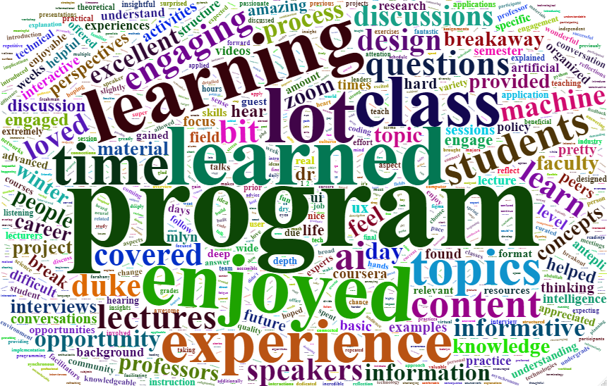

```{r setup, include=FALSE}
knitr::opts_chunk$set(echo = FALSE)
```

```{r, echo=FALSE, message=FALSE, warning=FALSE}
  library(tidyverse)
  library(tidytext)
  library(readxl)
  library(wordcloud2)

wbasurvey<-read_excel("WBA Student Survey.xlsx")
wbasurvey<-wbasurvey%>%
  rename(Program='Which program', 
         text='Overall feedback')%>%
  select(Program, text)
wbasurvey<-wbasurvey%>%
  filter(text!="N/A" & text!="N/a")
wbasurvey_tidy<-wbasurvey%>%
  unnest_tokens(word, text)
wbasurvey_clean<-wbasurvey_tidy%>%
  anti_join(stop_words)
wbasurvey_counts<-wbasurvey_clean%>%
  count(word, sort=TRUE)

```

## Questions

1. Were Duke students overall satisfied with their experience in the inaugural 
Winter Breakaway program?  

2. Should this program be offered in the future?  

>More information: [Duke Winter Breakaway](https://winterbreakaway.duke.edu/)
>

## Methods

**Data Source**: Winter Breakaway student survey collected via Qualtrics and filtered to
extract program name and survey response to overall satisfaction   
**Data Processing**: Tokenized and tidied text  
**Data Analysis**: Word Counts & TF-IDF

# Findings


## Words Used to indicate satisfaction with experience

```{r, eval=F, echo=F}
wordcloud2(wbasurvey_counts, fontFamily = 'EB Garamond', color='random-dark')

```
{width=75%}

## Top 20 Words

```{r}
wbasurvey_counts%>%
  filter(n>16)%>%
  mutate(word=reorder(word,n))%>%
  ggplot(aes(n, word, fill=word))+
  geom_col()+
  labs(title="Winter Breakaway Student Survey: Satisfaction", x="Word Count", y=NULL)+
  theme (legend.position="none")
```


## Words Emphasized by each program

```{r, message=FALSE}

wbasurvey_program_counts<-wbasurvey_clean%>%
  count(Program, word, sort=TRUE)
wbasurvey_frequencies<-wbasurvey_clean%>%
  count(Program, word, sort=TRUE)%>%
  group_by(Program)
wbasurvey_words<-wbasurvey%>%
  unnest_tokens(word, text)%>%
  count(Program, word, sort=TRUE)
total_words<-wbasurvey_words%>%
  group_by(Program)%>%
  summarise(total=sum(n))
wbasurvey_totals<-left_join(wbasurvey_words, total_words)
wbasurvey_tf_idf<-wbasurvey_totals%>%
  bind_tf_idf(word, Program, n)
wbasurvey_tf_idf%>%
  group_by(Program)%>%
  slice_max(tf_idf, n=4)%>%
  ungroup()%>%
  mutate(Program=as.factor(Program),
         word=reorder_within(word, tf_idf, Program))%>%
  ggplot(aes(word, tf_idf, fill=Program))+
  geom_col(show.legend = FALSE)+
  facet_wrap(~Program, ncol=4, scales="free")+
  theme(strip.text=element_text(size=8))+
  coord_flip()+
  scale_x_reordered()+
  labs(title="Words unique to each Program", x="tf-idf value", y=NULL)

```

## Conclusions

1. Students seem satisfied with the program - by word frequency, 'learned', 'alot','enjoyed', and 'engaging' were some of the most frequently referenced. 
2. Duke should explore preserving this type of learning format for Duke students so they can explore topics outside of their normal course of study without the pressure of grades.  


## Discussion
1. **Limitations**:With a relatively small survey response (n=307), the tf-idf analysis did not yield very revealing results in regards to satisfaction. The words emphasized had more to do with the focus of the program than satisfaction.  
2. **Implications**: Students are interested in engaging in learning opportunities outside of the traditional semester timeframe and exploring topics that are not normally taught in the traditional Duke curriculum. 
3. **Next steps for Analysis**: Take a deeper dive into both positive and negative feedback from both students and faculty. Faculty feedback will be important to see if there is buy-in for preserving the program. 

